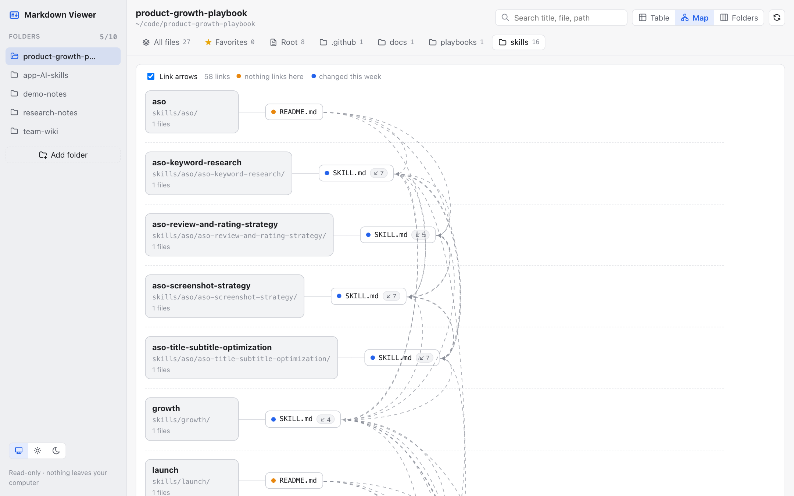
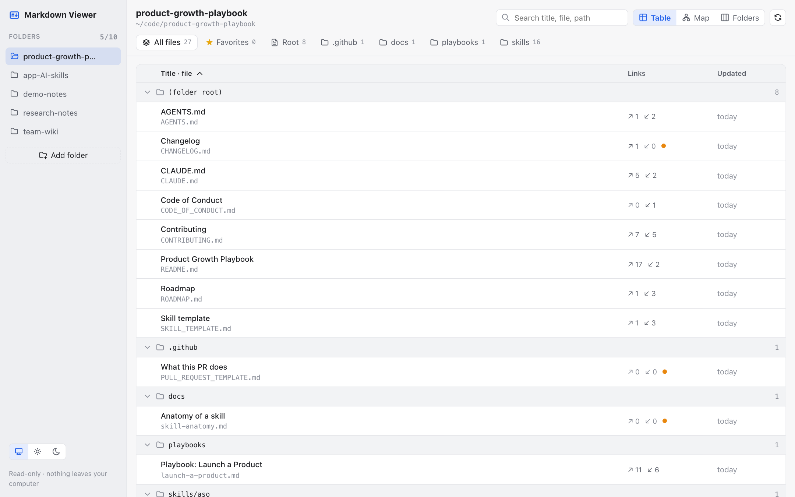
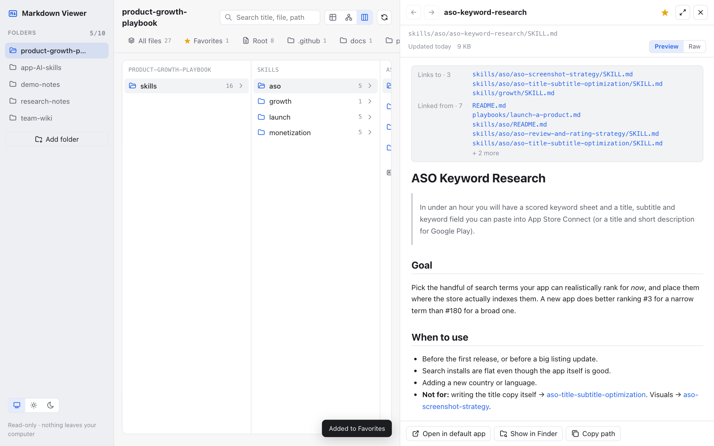

# Product Growth Playbook

**100% free AI growth skills, research templates and a free Markdown app for people building apps, extensions, games, plugins and AI tools: research, case studies, store listing by niche, ASO, launch and monetization.**

[](#what-you-get-all-free)
[](LICENSE)
[](CONTRIBUTING.md)
[](https://agentskills.io)

You can build the product. This repo helps with the part after that: **finding out what users want, getting found,
publishing on the stores, launching, and getting paid.** Every skill is a short, step-by-step guide with a copy-paste AI prompt. Follow it in
under an hour and you end up with something real: a keyword list, a launch plan, a price, a research report.

## What you get (all free)

| | What | Why it helps you |
|---|---|---|
| 🧠 | **28 free AI growth skills** | Research, case studies, store listing by niche, ASO, launch and monetization, each with a copy-paste prompt for Claude, ChatGPT, Gemini or Cursor. Or follow the steps by hand. |
| 🔎 | **A tidy research system** | Where to find trustworthy sources, where users ask for software (with links), how to mine competitor reviews, and templates to keep notes, sources and decisions organized in Markdown. |
| 🗺️ | **Step-by-step playbooks** | A 6-week route from "almost ready" to your first 100 users, built from the skills. |
| 📖 | **A free app to read it all** | [Markdown Viewer](https://oneclicktool.app/macos/markdown-viewer?utm_source=github&utm_medium=readme&utm_campaign=growth-playbook&utm_content=what-you-get) (Mac) shows this repo, or your own research folder, as a table, a link map or Finder-style folders. |

No sign-up, no paywall, no email list. MIT licensed: use it, fork it, teach with it.

## Who it's for
Indie developers, solo founders and small teams building **apps, SaaS, games, AI tools, plugins, websites or browser
extensions**, especially if you're a builder, not a marketer.

## Why use this instead of blog posts or courses
- **Actionable.** Each skill is one task, under an hour, with a concrete output. No theory dumps, no "10 generic tips".
- **Works with any AI, or none.** Copy the prompt into any chat, install the skills in an AI agent, or follow the steps yourself.
- **Honest.** Store rules cite official sources. Example numbers are real, or clearly labelled *Illustrative*.
- **Yours.** Everything is plain Markdown you can copy into your own repo, where your AI agent can read it next time.

## New here? Start in 3 steps
1. **Find your situation** in the table below. Not sure? Start with [`growth`](skills/growth/SKILL.md): 4 questions, one next step.
2. **Open the skill** and copy its *Prompt* block into your AI chat. Fill in the `{{ }}` parts.
3. **Follow the steps** and save the result as a `.md` file in your project, so you can build on it later.

| You want to… | Start here |
|---|---|
| Check an idea before building | [Where Users Ask About Software](skills/research/research-where-users-ask/SKILL.md) → [Review Mining](skills/research/research-review-mining/SKILL.md) |
| Learn from competitors ("learn from the enemy") | [Competitor Teardown](skills/case-study/case-study-competitor-teardown/SKILL.md) → [Success Story Analysis](skills/case-study/case-study-success-story-analysis/SKILL.md) |
| Find facts you can trust | [Source Finding](skills/research/research-source-finding/SKILL.md) |
| Stop losing research in tabs and chats | [Research Doc Organization](skills/research/research-doc-organization/SKILL.md) |
| Publish on the App Store / Google Play, step by step | [App Store Listing](skills/listing/listing-app-store/SKILL.md) · [Google Play Listing](skills/listing/listing-google-play/SKILL.md) |
| Publish a small product: extension, Mac app, game, plugin, AI tool | [Listing by niche](skills/listing/README.md#by-niche-small-products) |
| List the app for free in more places | [Free Directories & Alternative Stores](skills/listing/listing-free-directories/SKILL.md) |
| Launching soon | [Playbook: Launch a Product](playbooks/launch-a-product.md), a 6-week route |
| Need downloads this week, with little time and no budget | [Quick Download Wins](skills/launch/launch-quick-download-wins/SKILL.md), 16 channels ranked by effort |
| Launched, but nobody's using it | [Get Your First 100 Users](skills/launch/launch-get-first-100-users/SKILL.md) |
| Get more installs from App Store / Google Play search | [ASO Keyword Research](skills/aso/aso-keyword-research/SKILL.md) |
| Start making money | [Free Trial vs Freemium](skills/monetization/monetization-free-trial-vs-freemium/SKILL.md) → [Pricing Strategy](skills/monetization/monetization-pricing-strategy/SKILL.md) |

## Skills

| Area | Skills |
|---|---|
| 🔎 [Research](skills/research/) | [Source Finding](skills/research/research-source-finding/SKILL.md) · [Research Doc Organization](skills/research/research-doc-organization/SKILL.md) · [Where Users Ask](skills/research/research-where-users-ask/SKILL.md) · [Review Mining](skills/research/research-review-mining/SKILL.md) |
| 🧪 [Case Study](skills/case-study/) | [Competitor Teardown](skills/case-study/case-study-competitor-teardown/SKILL.md) · [Success Story Analysis](skills/case-study/case-study-success-story-analysis/SKILL.md) · [Write Your Own Case Study](skills/case-study/case-study-write-your-own/SKILL.md) |
| 📦 [Listing](skills/listing/) | [App Store](skills/listing/listing-app-store/SKILL.md) · [Google Play](skills/listing/listing-google-play/SKILL.md) · [Browser Extension](skills/listing/listing-browser-extension/SKILL.md) · [Mac App](skills/listing/listing-mac-app/SKILL.md) · [Indie Game](skills/listing/listing-indie-game/SKILL.md) · [Plugin & Dev Tool](skills/listing/listing-dev-plugin/SKILL.md) · [AI Product](skills/listing/listing-ai-product/SKILL.md) · [Free Directories & Alternative Stores](skills/listing/listing-free-directories/SKILL.md) |
| 📱 [ASO](skills/aso/) | [Keyword Research](skills/aso/aso-keyword-research/SKILL.md) · [Title & Subtitle](skills/aso/aso-title-subtitle-optimization/SKILL.md) · [Screenshot Strategy](skills/aso/aso-screenshot-strategy/SKILL.md) · [Reviews & Ratings](skills/aso/aso-review-and-rating-strategy/SKILL.md) |
| 🚀 [Launch](skills/launch/) | [Pre-launch Checklist](skills/launch/launch-pre-launch-checklist/SKILL.md) · [Launch Post Writing](skills/launch/launch-post-writing/SKILL.md) · [Product Hunt Launch](skills/launch/launch-product-hunt-launch/SKILL.md) · [Quick Download Wins](skills/launch/launch-quick-download-wins/SKILL.md) · [First 100 Users](skills/launch/launch-get-first-100-users/SKILL.md) |
| 💰 [Monetization](skills/monetization/) | [Free Trial vs Freemium](skills/monetization/monetization-free-trial-vs-freemium/SKILL.md) · [Pricing Strategy](skills/monetization/monetization-pricing-strategy/SKILL.md) · [Paywall Design](skills/monetization/monetization-paywall-design/SKILL.md) · [Subscription Tiers](skills/monetization/monetization-subscription-tiers/SKILL.md) |

**Playbooks:** [Launch a Product](playbooks/launch-a-product.md) · **Roadmap:** [what's next](ROADMAP.md)

### 📖 Read the whole playbook as a map

35+ Markdown files link to each other here. Open the repo in **[Markdown Viewer](https://oneclicktool.app/macos/markdown-viewer?utm_source=github&utm_medium=readme&utm_campaign=growth-playbook&utm_content=skills-hook)**
(free, Mac) and you can see which skill leads to which, browse folders like in Finder, and ★ star the skills you
use most. It's read-only, and nothing leaves your computer.

[](https://oneclicktool.app/macos/markdown-viewer?utm_source=github&utm_medium=readme&utm_campaign=growth-playbook&utm_content=screenshot-map)

<details>
<summary>More screenshots: table view · Finder-style folders + reader with Favorites</summary>

[](https://oneclicktool.app/macos/markdown-viewer?utm_source=github&utm_medium=readme&utm_campaign=growth-playbook&utm_content=screenshot-table)

[](https://oneclicktool.app/macos/markdown-viewer?utm_source=github&utm_medium=readme&utm_campaign=growth-playbook&utm_content=screenshot-reader)

</details>

<sub>I made Markdown Viewer. It's free, and it's how I keep this repo organized. → [Download Markdown Viewer](https://oneclicktool.app/macos/markdown-viewer?utm_source=github&utm_medium=readme&utm_campaign=growth-playbook&utm_content=skills-hook-cta)</sub>

## Three ways to use a skill

**1. Any AI chat (Claude, ChatGPT, Gemini…):** open a skill, copy the *Prompt* block, fill in the `{{ }}` parts.

**2. Claude Code:**

```text
/plugin marketplace add OneClickTool/product-growth-playbook
/plugin install product-growth-playbook@product-growth-playbook
```

Then just describe your problem ("my app gets no search traffic"). The matching skill loads on its own.

**3. Codex, Cursor, Gemini CLI and other agents:**

```bash
npx skills add OneClickTool/product-growth-playbook
```

Or copy a skill folder into your agent's skills directory (for example `~/.claude/skills/`).

> **Tip:** every skill is a Markdown file, and most produce one (a checklist, a keyword sheet, a plan). To browse a folder
> of them as a table or a map of links, try [Markdown Viewer](https://oneclicktool.app/macos/markdown-viewer?utm_source=github&utm_medium=readme&utm_campaign=growth-playbook&utm_content=how-to-use) (free, Mac). I made it at
> [OneClickTool](https://oneclicktool.app/?utm_source=github&utm_medium=readme&utm_campaign=growth-playbook&utm_content=how-to-use).

## What makes a skill here

Every skill has the same parts: **Goal · When to use · Inputs · Steps · Prompt · Example output · Common mistakes**.
No theory dumps, no "10 generic tips". If you can't finish it in an hour and end up with something concrete,
it isn't done. Example numbers are either real or clearly labelled *Illustrative*.

## Contributing (no coding needed)

The easiest ways to help, from 2 minutes to an hour:
1. **⭐ Star the repo** so more builders find it.
2. **Tried a skill?** Tell us what worked or didn't with a [Skill feedback](https://github.com/OneClickTool/product-growth-playbook/issues/new?template=skill-feedback.yml) issue.
3. **Know a great community, source or tool** that's missing? Open an issue or edit the file on GitHub (the ✏️ button).
4. **Share real numbers** from your launch, ASO test or price change as a [case study](skills/case-study/case-study-write-your-own/SKILL.md). Real examples are the most valuable thing here.
5. **Write a skill.** Copy the [template](SKILL_TEMPLATE.md) and follow [CONTRIBUTING.md](CONTRIBUTING.md), which has a step-by-step guide for first-timers.

## Author

Maintained by [Tu Nguyen (@nvminhtu)](https://github.com/nvminhtu), who builds and ships small apps and tools
at [OneClickTool](https://oneclicktool.app/?utm_source=github&utm_medium=readme&utm_campaign=growth-playbook).

Two tools I made that fit this repo:
- Reading lots of skills and Markdown files? [Markdown Viewer](https://oneclicktool.app/macos/markdown-viewer?utm_source=github&utm_medium=readme&utm_campaign=growth-playbook) (free, Mac) shows a whole folder at a glance.
- Running many projects with AI agents? [ShotMatic](https://shotmatic.app/?utm_source=github&utm_medium=readme&utm_campaign=growth-playbook) (Mac) shows every repo's next steps, blockers and uncommitted changes on one screen, and reopens the right Claude session.

## Support this project

The playbook is free and always will be. If a skill saved you time or helped you ship, you can support the work:

[](https://ko-fi.com/icecraftdigital)
<!-- Add once GitHub Sponsors is approved:
[](https://github.com/sponsors/nvminhtu)
-->

- [Ko-fi](https://ko-fi.com/icecraftdigital): one-time support, no account needed.
- Use a [OneClickTool](https://oneclicktool.app/?utm_source=github&utm_medium=readme&utm_campaign=growth-playbook&utm_content=support) app. *Free knowledge, paid tools.*
- Free ways that help just as much: ⭐ star the repo, share a skill that worked, or add a real example.

Support pays for the time spent writing new skills, keeping store rules up to date, and answering issues.

## License

[MIT](LICENSE). Use it, fork it, teach with it.
