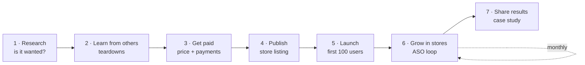
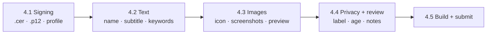

# Growth Map

The whole playbook on one page, in the order you'll need it. Every chapter has the same six parts, so you always
know where to look:

| | Part | What it answers |
|---|---|---|
| 🧠 | **Skills** | Which skill in this repo to open |
| 🔎 | **Research** | What to find out before you start |
| 🛠️ | **Tools** | Websites and apps that help with the work |
| 📚 | **References** | Official rules, limits and docs to check |
| 📄 | **Templates** | Files to copy into your project and fill in |
| 💬 | **Prompt** | The copy-paste prompt to run |

Not sure which chapter you're in? Start with [`growth`](../skills/growth/SKILL.md): 4 questions, one next step.
Want a dated route instead of a map? Use [Launch a Product](launch-a-product.md) (6 weeks) or
[ASO Optimization](aso-optimization.md) (4 weeks + monthly loop).



Tools listed here are examples that are free or have a free tier, not endorsements. Check each one's current terms.

---

## 1. Research: is it wanted?

| Part | |
|---|---|
| 🧠 Skills | [research-where-users-ask](../skills/research/research-where-users-ask/SKILL.md) → [research-review-mining](../skills/research/research-review-mining/SKILL.md) · [research-source-finding](../skills/research/research-source-finding/SKILL.md) · [research-doc-organization](../skills/research/research-doc-organization/SKILL.md) |
| 🔎 Research | Where your users ask for software, what they complain about in competitors' reviews, facts you can trust |
| 🛠️ Tools | [Google Trends](https://trends.google.com/) · [F5Bot](https://f5bot.com/) (Reddit/HN alerts) · [AlternativeTo](https://alternativeto.net/) · [G2](https://www.g2.com/) · [Wayback Machine](https://web.archive.org/) |
| 📚 References | The source-quality rules in [research-source-finding](../skills/research/research-source-finding/SKILL.md) |
| 📄 Templates | [research-note.md](../skills/research/research-doc-organization/assets/research-note.md) · [sources-template.md](../skills/research/research-doc-organization/assets/sources-template.md) · [decisions-template.md](../skills/research/research-doc-organization/assets/decisions-template.md) |
| 💬 Prompt | [Where users ask](../skills/research/research-where-users-ask/SKILL.md#prompt-copy-paste) · [Review mining](../skills/research/research-review-mining/SKILL.md#prompt-copy-paste) |
| ✅ You end with | Top 3 unmet needs, in users' own words, saved in `research/` |

## 2. Learn from others: teardowns

| Part | |
|---|---|
| 🧠 Skills | [case-study-competitor-teardown](../skills/case-study/case-study-competitor-teardown/SKILL.md) → [case-study-success-story-analysis](../skills/case-study/case-study-success-story-analysis/SKILL.md) → [case-study-award-winning-design](../skills/case-study/case-study-award-winning-design/SKILL.md) |
| 🔎 Research | Your top 3 competitors' listing, pricing, onboarding, ads and launch history |
| 🛠️ Tools | [Meta Ad Library](https://www.facebook.com/ads/library/) · [Google Ads Transparency Center](https://adstransparency.google.com/) · [BuiltWith](https://builtwith.com/) · [Similarweb](https://www.similarweb.com/) |
| 📚 References | The competitors' own store pages and changelogs (primary sources beat blog posts) · award programs in [sources.md](../skills/case-study/case-study-award-winning-design/references/sources.md) |
| 📄 Templates | [teardown-sheet.md](../skills/case-study/case-study-competitor-teardown/assets/teardown-sheet.md) · [result-report.md](../skills/case-study/case-study-award-winning-design/assets/result-report.md) · [apply-plan.md](../skills/case-study/case-study-award-winning-design/assets/apply-plan.md) |
| 💬 Prompt | [Competitor teardown](../skills/case-study/case-study-competitor-teardown/SKILL.md#prompt-copy-paste) · [Award-winning design](../skills/case-study/case-study-award-winning-design/SKILL.md#prompt-copy-paste) |
| ✅ You end with | What to copy, what to do differently, and one gap to own |

## 3. Get paid: price and payments

| Part | |
|---|---|
| 🧠 Skills | [monetization-free-trial-vs-freemium](../skills/monetization/monetization-free-trial-vs-freemium/SKILL.md) → [monetization-pricing-strategy](../skills/monetization/monetization-pricing-strategy/SKILL.md) → [monetization-payment-setup](../skills/monetization/monetization-payment-setup/SKILL.md) → [monetization-in-app-purchase-setup](../skills/monetization/monetization-in-app-purchase-setup/SKILL.md) → [monetization-paywall-design](../skills/monetization/monetization-paywall-design/SKILL.md) · [monetization-subscription-tiers](../skills/monetization/monetization-subscription-tiers/SKILL.md) |
| 🔎 Research | Competitors' prices (chapter 2), which payment providers accept your country, review times |
| 🛠️ Tools | [StoreKit Testing in Xcode](https://developer.apple.com/documentation/xcode/setting-up-storekit-testing-in-xcode) · [Play license testers](https://support.google.com/googleplay/android-developer/answer/6062777) · provider dashboards listed in the payment skill |
| 📚 References | [payment-providers-by-country.md](../skills/monetization/monetization-payment-setup/references/payment-providers-by-country.md) · [iap-platform-facts.md](../skills/monetization/monetization-in-app-purchase-setup/references/iap-platform-facts.md) · [App Review Guidelines](https://developer.apple.com/app-store/review/guidelines/) · [Play payments policy](https://support.google.com/googleplay/android-developer/answer/9858738) |
| 📄 Templates | [payment-setup-sheet.md](../skills/monetization/monetization-payment-setup/assets/payment-setup-sheet.md) · [minimal-code.md](../skills/monetization/monetization-in-app-purchase-setup/references/minimal-code.md) (StoreKit 2 + Kotlin) |
| 💬 Prompt | [Pricing](../skills/monetization/monetization-pricing-strategy/SKILL.md#prompt-copy-paste) · [Payment setup](../skills/monetization/monetization-payment-setup/SKILL.md#prompt-copy-paste) · [Paywall](../skills/monetization/monetization-paywall-design/SKILL.md#prompt-copy-paste) |
| ✅ You end with | A price, an approved payment provider and one real test purchase |

## 4. Publish: store listing

Pick your store. Apps: [listing-app-store](../skills/listing/listing-app-store/SKILL.md) ·
[listing-google-play](../skills/listing/listing-google-play/SKILL.md). Anything else:
[browser extension](../skills/listing/listing-browser-extension/SKILL.md) · [Mac app](../skills/listing/listing-mac-app/SKILL.md) ·
[indie game](../skills/listing/listing-indie-game/SKILL.md) · [plugin & dev tool](../skills/listing/listing-dev-plugin/SKILL.md) ·
[AI product](../skills/listing/listing-ai-product/SKILL.md) · [Notion/Gumroad template](../skills/listing/listing-digital-template/SKILL.md).
Then add free reach with [listing-free-directories](../skills/listing/listing-free-directories/SKILL.md) and its
[Listing Desk](../skills/listing/listing-free-directories/assets/listing-desk.html).

### Example: App Store, part by part
A listing is five parts. Do them in this order; each one names the files you make, how, and what helps.



#### 4.1 Signing: certificates and profiles
Most solo developers can let Xcode do this: *Signing & Capabilities → Automatically manage signing*. Make the files by
hand only for CI, a second Mac, or a team. No skill covers this yet; the official docs below are the guide.

| File | What it is | How you make it |
|---|---|---|
| `.certSigningRequest` (CSR) | A request that holds your public key | Keychain Access → Certificate Assistant → *Request a Certificate From a Certificate Authority* |
| `.cer` | Your **Apple Distribution** certificate, issued by Apple | Upload the CSR in *Certificates, Identifiers & Profiles* → download |
| `.p12` | The certificate **plus its private key**, password-protected | Keychain Access → export the certificate. Needed on any other machine that signs. Never commit it |
| App ID (bundle ID) | Your app's unique ID, e.g. `com.you.app` | *Identifiers → +* in the developer account |
| `.mobileprovision` | App Store provisioning profile: App ID + certificate | *Profiles → +* → App Store, then download |
| `.p8` | App Store Connect API key, for fastlane or CI uploads | App Store Connect → *Users and Access → Integrations* |

| Part | |
|---|---|
| 🛠️ Tools | Xcode (automatic signing) · Keychain Access · [fastlane match](https://docs.fastlane.tools/actions/match/) (shares signing files across a team) |
| 📚 References | [Certificates overview](https://developer.apple.com/help/account/certificates/certificates-overview) · [Create a CSR](https://developer.apple.com/help/account/certificates/create-a-certificate-signing-request) · [Register an App ID](https://developer.apple.com/help/account/manage-identifiers/register-an-app-id) · [App Store provisioning profile](https://developer.apple.com/help/account/provisioning-profiles/create-an-app-store-provisioning-profile) · [App Store Connect API](https://developer.apple.com/help/app-store-connect/get-started/app-store-connect-api) |

*Google Play equivalent:* an **upload key** (a `.jks` keystore from Android Studio) signs what you upload, and
Play App Signing holds the real app signing key. See [Play App Signing](https://developer.android.com/studio/publish/app-signing).

#### 4.2 Text: name, subtitle, keywords, description

| Part | |
|---|---|
| 🧠 Skills | [aso-keyword-research](../skills/aso/aso-keyword-research/SKILL.md) → [aso-title-subtitle-optimization](../skills/aso/aso-title-subtitle-optimization/SKILL.md) → Level 1 of [listing-app-store](../skills/listing/listing-app-store/SKILL.md) |
| 🔎 Research | Words users actually type (chapter 1 phrases), competitors' names and subtitles |
| 🛠️ Tools | App Store search on a phone (autocomplete) · [pack_keywords.py](../skills/aso/aso-keyword-research/scripts/pack_keywords.py) (fits the 100-byte keyword field) |
| 📚 References | [App Store Connect Help](https://developer.apple.com/help/app-store-connect/) · [App Review Guidelines](https://developer.apple.com/app-store/review/guidelines/) (no competitor names in metadata) |
| 📄 Templates | [keyword-sheet.csv](../skills/aso/aso-keyword-research/assets/keyword-sheet.csv) · [app-store-listing-sheet.md](../skills/listing/listing-app-store/assets/app-store-listing-sheet.md) |
| 💬 Prompt | [Keyword research](../skills/aso/aso-keyword-research/SKILL.md#prompt-copy-paste) · [Title & subtitle](../skills/aso/aso-title-subtitle-optimization/SKILL.md#prompt-copy-paste) · [Listing sheet](../skills/listing/listing-app-store/SKILL.md#prompt-copy-paste) |

#### 4.3 Images: icon, screenshots, preview video

| Asset | Size (check before each submission) | Made with |
|---|---|---|
| App icon | 1024 × 1024, set in the Xcode project | [Icon Composer](https://developer.apple.com/icon-composer/) or any design tool + [App icon guidelines](https://developer.apple.com/design/human-interface-guidelines/app-icons) |
| iPhone screenshots | 6.9" · 1320 × 2868 portrait, required, up to 10 | Simulator (*File → Save Screen*) or [fastlane snapshot](https://docs.fastlane.tools/actions/snapshot/) |
| iPad screenshots | 13" · 2064 × 2752, if the app runs on iPad | Same |
| App preview (optional) | 15–30 s, up to 3 | Simulator screen recording, then trim |

**Process:**
1. **Plan the shot list** with [aso-screenshot-strategy](../skills/aso/aso-screenshot-strategy/SKILL.md): slot 1 = core outcome,
   slot 2 = differentiator, slot 3 = proof or ease. Captions of 2–6 words.
2. **Capture real screens** with demo data that looks lived-in, in every language you list.
3. **Add captions and frames** in a design file ([Apple Design Resources](https://developer.apple.com/design/resources/)
   has device frames), or automate it with [fastlane frameit](https://docs.fastlane.tools/actions/frameit/).
4. **Export at the exact pixel size** and check the set as thumbnails: can you read each caption?
5. **Upload**, then test one variable later with Product Page Optimization (chapter 6).

| Part | |
|---|---|
| 📚 References | [Screenshot specifications](https://developer.apple.com/help/app-store-connect/reference/app-information/screenshot-specifications) · [App preview specifications](https://developer.apple.com/help/app-store-connect/reference/app-information/app-preview-specifications) · Google Play: [Add preview assets](https://support.google.com/googleplay/android-developer/answer/9866151) (icon 512 × 512, feature graphic 1024 × 500) |
| 💬 Prompt | [Screenshot strategy](../skills/aso/aso-screenshot-strategy/SKILL.md#prompt-copy-paste) |

#### 4.4 Privacy and review

| Part | |
|---|---|
| 🧠 Skills | Level 1, steps 3, 5 and 8 of [listing-app-store](../skills/listing/listing-app-store/SKILL.md) |
| 🔎 Research | What data **each SDK** you ship collects (analytics, crash, ads, payments), from its own docs |
| 📚 References | [App Review Guidelines](https://developer.apple.com/app-store/review/guidelines/) · [App Store Connect Help](https://developer.apple.com/help/app-store-connect/) |
| 📄 Templates | Privacy and review-notes sections of [app-store-listing-sheet.md](../skills/listing/listing-app-store/assets/app-store-listing-sheet.md) |

#### 4.5 Build and submit
Xcode → *Product → Archive → Distribute App → App Store Connect* (or Transporter). Select the build, answer export
compliance, choose a **manual** release for a first launch, submit. Official guide:
[Distributing your app](https://developer.apple.com/documentation/xcode/distributing-your-app-for-beta-testing-and-releases).
Leave time for one rejection round: schedule it with [launch-pre-launch-checklist](../skills/launch/launch-pre-launch-checklist/SKILL.md).

## 5. Launch: first 100 users

| Part | |
|---|---|
| 🧠 Skills | [launch-pre-launch-checklist](../skills/launch/launch-pre-launch-checklist/SKILL.md) → [launch-post-writing](../skills/launch/launch-post-writing/SKILL.md) → [launch-product-hunt-launch](../skills/launch/launch-product-hunt-launch/SKILL.md) (optional) → [launch-quick-download-wins](../skills/launch/launch-quick-download-wins/SKILL.md) → [launch-get-first-100-users](../skills/launch/launch-get-first-100-users/SKILL.md) · open source: [launch-github-repo-seeding](../skills/launch/launch-github-repo-seeding/SKILL.md) |
| 🔎 Research | Each channel's self-promotion rules; where your users gather (chapter 1) |
| 🛠️ Tools | [Hacker News](https://news.ycombinator.com/) · [Indie Hackers](https://www.indiehackers.com/) · [Listing Desk](../skills/listing/listing-free-directories/assets/listing-desk.html) |
| 📚 References | [Show HN guidelines](https://news.ycombinator.com/showhn.html) · [GitHub Acceptable Use Policies](https://docs.github.com/en/site-policy/acceptable-use-policies/github-acceptable-use-policies) |
| 📄 Templates | [launch-kit.md](../skills/listing/listing-free-directories/assets/launch-kit.md) · [directory-tracker.csv](../skills/listing/listing-free-directories/assets/directory-tracker.csv) |
| 💬 Prompt | [Pre-launch checklist](../skills/launch/launch-pre-launch-checklist/SKILL.md#prompt-copy-paste) · [Launch posts](../skills/launch/launch-post-writing/SKILL.md#prompt-copy-paste) |
| ✅ You end with | Posts live, every comment answered, a log of which channel brought *activated* users |

## 6. Grow in stores: the ASO loop

| Part | |
|---|---|
| 🧠 Skills | [Playbook: ASO Optimization](aso-optimization.md): keywords → title → [screenshots](../skills/aso/aso-screenshot-strategy/SKILL.md) → [reviews & ratings](../skills/aso/aso-review-and-rating-strategy/SKILL.md) |
| 🔎 Research | Your weakest funnel step: impressions, page views or conversion (28-day baseline) |
| 🛠️ Tools | App Store Connect *App Analytics* · Play Console *Store performance* · Product Page Optimization / store listing experiments |
| 📚 References | [App Store Connect Help](https://developer.apple.com/help/app-store-connect/) · [Play Console Help](https://support.google.com/googleplay/android-developer/) |
| 📄 Templates | `growth/aso-log.md` (format in the [playbook](aso-optimization.md#the-monthly-loop)) |
| 💬 Prompt | [Review & rating strategy](../skills/aso/aso-review-and-rating-strategy/SKILL.md#prompt-copy-paste) |
| ✅ You end with | One change per month, logged with before/after numbers |

## 7. Share results: write a case study

| Part | |
|---|---|
| 🧠 Skills | [case-study-write-your-own](../skills/case-study/case-study-write-your-own/SKILL.md) |
| 📄 Templates | [case-study-template.md](../skills/case-study/case-study-write-your-own/assets/case-study-template.md) |
| 💬 Prompt | [Write your own](../skills/case-study/case-study-write-your-own/SKILL.md#prompt-copy-paste) |

---

## One prompt for the whole map
Paste this into any AI chat to find where you are and what to do next.

````text
You are a growth coach for small digital products. Use this 7-chapter map:
1 Research · 2 Learn from others · 3 Get paid · 4 Publish (listing) · 5 Launch · 6 Grow in stores · 7 Share results.

My product: {{what it is, who for, where it lives (App Store, Google Play, web, Chrome Web Store...)}}
Stage: {{idea / building / launched < 3 months / launched longer}}
Numbers: {{users or downloads per week, revenue if any}}
Done so far: {{e.g. keyword sheet, pricing, listing submitted}}
What feels most broken: {{...}}

1. Tell me which chapter I'm in and why, in two sentences.
2. List what's missing from that chapter as a checklist: files to create, research to do, official docs to check.
3. Give me the single next task I can finish in under an hour, and what file I'll have at the end.
Don't invent facts about my product; mark unknowns as TODO.
````

## Keep it in your repo
Save every output next to your code, one folder per chapter: `research/`, `growth/pricing.md`,
`growth/listing.md`, `growth/screenshots.md`, `growth/LAUNCH.md`, `growth/aso-log.md`. Your AI agent can read
them next session and pick up where you left off.
